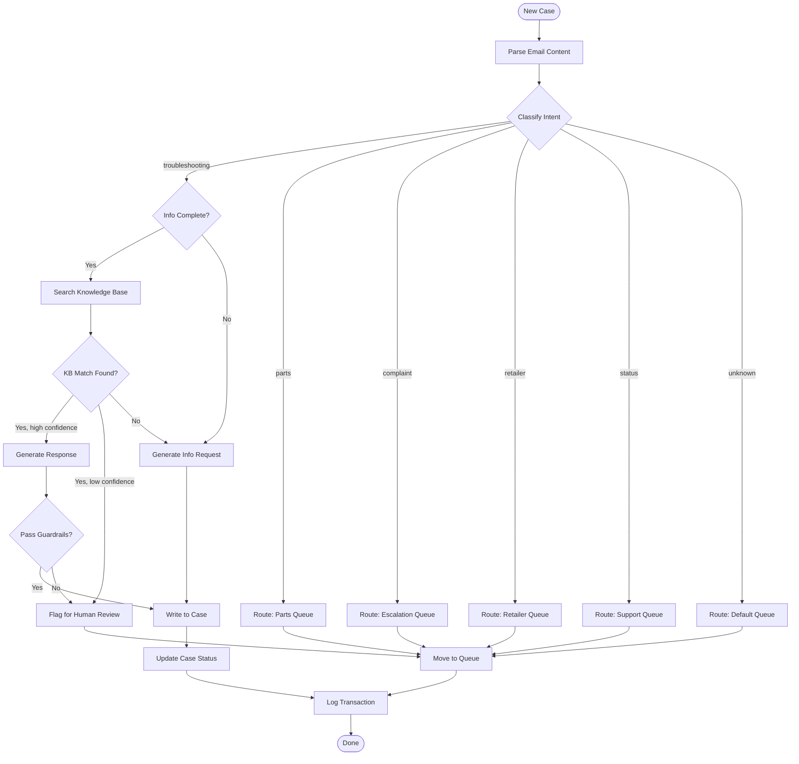

# Solution Design

> **Document Type:** Technical Implementation Specification
> **Audience:** Implementation Engineers, Support Team, Technical Stakeholders
> **Purpose:** Define how the Digital Employee is built, integrated, and monitored

---

## Document Control

| Field | Value |
|-------|-------|
| **Client** | [Company Name] |
| **Digital Employee** | [DE Name] |
| **Version** | 1.0 |
| **Status** | Draft / Approved |
| **Classification** | Internal / Client-Shared |
| **Last Updated** | [Date] |
| **Author** | [Implementation Engineer] |

**Related Documents:**
- Digital Employee Design v[X] (scope reference)
- Test Plan v[X] (validation reference)

---

## 1. Architecture

### 1.1 System Context Diagram

```
┌─────────────────────────────────────────────────────────────────────────┐
│                           CLIENT ENVIRONMENT                            │
│                                                                         │
│   ┌──────────────┐         ┌──────────────┐         ┌──────────────┐  │
│   │   Inbound    │         │    Client    │         │   Outbound   │  │
│   │   Channels   │         │   Systems    │         │   Channels   │  │
│   │              │         │              │         │              │  │
│   │ • Email      │         │ • CRM        │         │ • Email      │  │
│   │ • Web Forms  │         │ • ERP        │         │ • SMS        │  │
│   │ • Chat       │         │ • Knowledge  │         │ • Portal     │  │
│   └──────┬───────┘         └──────┬───────┘         └──────▲───────┘  │
│          │                        │                        │           │
└──────────┼────────────────────────┼────────────────────────┼───────────┘
           │                        │                        │
           ▼                        ▼                        │
┌──────────────────────────────────────────────────────────────────────────┐
│                         FREEDAY PLATFORM                                 │
│                                                                          │
│   ┌─────────────────────────────────────────────────────────────────┐   │
│   │                    [DE NAME] AGENT                               │   │
│   │                                                                  │   │
│   │  ┌────────────┐  ┌────────────┐  ┌────────────┐  ┌───────────┐ │   │
│   │  │  Ingestion │─▶│ Processing │─▶│ Generation │─▶│  Delivery │ │   │
│   │  │            │  │            │  │            │  │           │ │   │
│   │  │ • Polling  │  │ • Classify │  │ • Draft    │  │ • API     │ │   │
│   │  │ • Webhook  │  │ • Extract  │  │ • Format   │  │ • Queue   │ │   │
│   │  │ • Parse    │  │ • Route    │  │ • Validate │  │ • Send    │ │   │
│   │  └────────────┘  └────────────┘  └────────────┘  └───────────┘ │   │
│   │                                                                  │   │
│   │  ┌────────────────────────────────────────────────────────────┐ │   │
│   │  │                    KNOWLEDGE LAYER                         │ │   │
│   │  │  • Vector DB (embeddings)  • Business Rules  • Templates   │ │   │
│   │  └────────────────────────────────────────────────────────────┘ │   │
│   └─────────────────────────────────────────────────────────────────┘   │
│                                                                          │
│   ┌─────────────────────────────────────────────────────────────────┐   │
│   │                    OBSERVABILITY                                 │   │
│   │  • Logs  • Metrics  • Traces  • Alerts                          │   │
│   └─────────────────────────────────────────────────────────────────┘   │
│                                                                          │
└──────────────────────────────────────────────────────────────────────────┘
```

### 1.2 Data Flow

```
1. INGESTION
   └─▶ Poll [System] every [X] minutes
   └─▶ Filter: [Criteria]
   └─▶ Parse: Extract subject, body, metadata, attachments

2. PROCESSING
   └─▶ Classify intent (confidence threshold: 0.7)
   └─▶ Extract entities (product, error code, customer info)
   └─▶ Apply routing rules
   └─▶ Search knowledge base (top-k: 5)

3. GENERATION
   └─▶ Select response strategy
   └─▶ Generate draft using context + KB results
   └─▶ Apply template formatting
   └─▶ Validate against guardrails

4. DELIVERY
   └─▶ Write response to [Field]
   └─▶ Update case status
   └─▶ Log transaction
```

---

## 2. AI Configuration

### 2.1 Model Stack

| Component | Model | Provider | Purpose | Config |
|-----------|-------|----------|---------|--------|
| Classification | `gpt-4-turbo` | OpenAI | Intent detection | temp: 0.0 |
| Entity Extraction | `gpt-4-turbo` | OpenAI | Data extraction | temp: 0.0 |
| Response Generation | `gpt-4-turbo` | OpenAI | Draft responses | temp: 0.3 |
| Embeddings | `text-embedding-3-large` | OpenAI | KB search | dim: 3072 |
| Guardrails | `gpt-4-turbo` | OpenAI | Safety validation | temp: 0.0 |

### 2.2 Classification Schema

```yaml
classification:
  version: "1.0"

  intents:
    - id: troubleshooting_complete
      description: "Customer has issue, all info provided"
      action: generate_response
      confidence_threshold: 0.8

    - id: troubleshooting_incomplete
      description: "Customer has issue, missing information"
      action: request_information
      confidence_threshold: 0.7

    - id: parts_request
      description: "Customer wants to order parts"
      action: route_to_queue
      target_queue: "[Queue ID]"

    - id: complaint
      description: "Customer expressing dissatisfaction"
      action: escalate
      priority: high

    - id: status_inquiry
      description: "Customer asking about existing case"
      action: route_to_queue
      target_queue: "[Queue ID]"

    # ... additional intents

  fallback:
    action: escalate
    reason: "Low confidence or unknown intent"
```

### 2.3 Entity Schema

```yaml
entities:
  - name: product_type
    type: enum
    values: [oven, dishwasher, washing_machine, dryer, cooktop, refrigerator]
    required: false

  - name: model_number
    type: string
    pattern: "^[A-Z]{2,4}[0-9]{3,5}[A-Z]?$"
    required: false

  - name: error_code
    type: string
    pattern: "^[A-Z][0-9]{1,3}$"
    required: false

  - name: purchase_date
    type: date
    required: false

  - name: customer_sentiment
    type: enum
    values: [positive, neutral, negative, angry]
    required: true
```

### 2.4 Prompt Templates

#### Classification Prompt

```markdown
## System
You are a classification system for customer service emails at [Company].
Analyze the email and determine the customer's intent.

## Classification Rules
1. If email contains CustomerNumber AND ReferenceNumber fields → retailer_mechanic_request
2. If customer mentions multiple failed service visits → complex_case
3. If customer asks about existing appointment → status_inquiry
4. [Additional rules...]

## Output Format
{
  "intent": "<intent_id>",
  "confidence": <0.0-1.0>,
  "reasoning": "<brief explanation>",
  "entities": { ... }
}

## Email to Classify
Subject: {subject}
Body: {body}
Metadata: {metadata}
```

#### Response Generation Prompt

```markdown
## System
You are [DE Name], a customer service assistant at [Company].
Generate a helpful response based on the customer inquiry and knowledge base results.

## Tone & Style
- Professional but friendly
- Use [formal/informal] language
- Always acknowledge the customer's situation first
- Provide clear, actionable steps
- End with next steps or offer of further help

## Guardrails
- Never promise refunds or compensation
- Never share other customers' information
- If unsure, say you'll have a colleague follow up
- Always be transparent about being an AI when asked

## Context
Customer Inquiry: {inquiry}
Intent: {intent}
Extracted Entities: {entities}
Knowledge Base Results: {kb_results}
Customer History: {history}

## Response Format
Generate a complete email response following the company template.
```

---

## 3. Integrations

### 3.1 Integration Overview

| System | Direction | Protocol | Auth | Frequency |
|--------|-----------|----------|------|-----------|
| [CRM System] | Bidirectional | REST API | OAuth 2.0 | Polling: 5 min |
| [Knowledge Base] | Inbound | REST API | API Key | Sync: Daily |
| [Email System] | Outbound | SMTP/API | OAuth 2.0 | Real-time |

### 3.2 [Primary System] Integration

**Connection Details:**

| Parameter | Value |
|-----------|-------|
| Base URL | `https://[instance].my.salesforce.com` |
| API Version | `v58.0` |
| Auth Endpoint | `/services/oauth2/token` |
| Rate Limit | 100,000 requests/day |

**Authentication:**

```yaml
auth:
  type: oauth2
  grant_type: client_credentials
  client_id: ${SALESFORCE_CLIENT_ID}
  client_secret: ${SALESFORCE_CLIENT_SECRET}
  token_url: https://login.salesforce.com/services/oauth2/token
  scope: api refresh_token
```

**Objects & Fields:**

| Object | Field | Type | Usage |
|--------|-------|------|-------|
| Case | Id | ID | Unique identifier |
| Case | Subject | String | Email subject |
| Case | Description | Text | Email body |
| Case | Status | Picklist | Case lifecycle |
| Case | OwnerId | Lookup | Queue/User assignment |
| Case | Origin | Picklist | Channel (Email/Web) |
| Case | [Custom]__c | Text | AI response field |
| Case | [Custom]__c | Number | AI confidence score |

**Queue Mappings:**

| Queue Name | Queue ID | Purpose |
|------------|----------|---------|
| [Queue 1] | `00G...` | Default intake |
| [Queue 2] | `00G...` | Parts department |
| [Queue 3] | `00G...` | Escalations |

**API Operations:**

```yaml
operations:
  get_new_cases:
    method: GET
    endpoint: /services/data/v58.0/query
    query: >
      SELECT Id, Subject, Description, Status, Origin, CreatedDate
      FROM Case
      WHERE OwnerId = '[QUEUE_ID]'
      AND Status = 'New'
      AND CreatedDate > [LAST_POLL_TIME]
    frequency: every 5 minutes

  update_case:
    method: PATCH
    endpoint: /services/data/v58.0/sobjects/Case/{id}
    payload:
      [Custom]__c: "{response}"
      Status: "In Progress"
      OwnerId: "{new_owner}"
```

### 3.3 Knowledge Base Integration

**Source Configuration:**

| Source | Type | Location | Update Frequency |
|--------|------|----------|------------------|
| Product FAQs | HTML/JSON | [URL/Path] | Daily |
| Product Manuals | PDF | [URL/Path] | Weekly |
| Troubleshooting Guides | Markdown | [URL/Path] | Daily |

**Embedding Configuration:**

```yaml
embedding:
  model: text-embedding-3-large
  dimensions: 3072
  chunk_size: 1000
  chunk_overlap: 200

vector_db:
  provider: pinecone
  index: [index_name]
  namespace: [client_name]

retrieval:
  top_k: 5
  similarity_threshold: 0.7
  reranking: true
```

---

## 4. Business Logic

### 4.1 Decision Tree



### 4.2 Routing Rules

```yaml
routing_rules:
  - name: retailer_priority
    description: "Retailer requests always go to dealer queue"
    priority: 1
    conditions:
      - field: "body"
        contains_all: ["CustomerNumber", "ReferenceNumber"]
    action:
      type: route
      queue: "[Retailer Queue ID]"

  - name: vip_customer
    description: "VIP customers get priority handling"
    priority: 2
    conditions:
      - field: "sender_domain"
        in: ["mediamarkt.nl", "coolblue.nl", "bol.com"]
    action:
      type: route
      queue: "[VIP Queue ID]"
      add_flag: "VIP"

  - name: complaint_detection
    description: "Complaints need human attention"
    priority: 3
    conditions:
      - field: "sentiment"
        equals: "angry"
      - field: "body"
        contains_any: ["klacht", "complaint", "onacceptabel", "terugbetaling"]
    action:
      type: escalate
      queue: "[Escalation Queue ID]"
      priority: high
```

### 4.3 Guardrails

```yaml
guardrails:
  pre_generation:
    - name: pii_detection
      description: "Detect and mask PII in input"
      action: mask

    - name: profanity_filter
      description: "Flag inappropriate content"
      action: escalate

  post_generation:
    - name: promise_detection
      description: "Detect unauthorized promises"
      patterns:
        - "refund"
        - "compensation"
        - "free of charge"
        - "guarantee"
      action: flag_for_review

    - name: hallucination_check
      description: "Verify claims against KB"
      action: validate
      threshold: 0.8

    - name: brand_voice_check
      description: "Ensure response matches brand guidelines"
      action: validate
```

---

## 5. Data Model

### 5.1 Internal Data Structures

```typescript
interface CaseTransaction {
  id: string;
  external_id: string;           // CRM case ID
  client_id: string;
  de_id: string;

  // Input
  channel: 'email' | 'web' | 'chat';
  subject: string;
  body: string;
  sender: string;
  received_at: DateTime;
  attachments: Attachment[];

  // Processing
  classification: {
    intent: string;
    confidence: number;
    entities: Record<string, any>;
    model: string;
    latency_ms: number;
  };

  kb_search: {
    query: string;
    results: KBResult[];
    latency_ms: number;
  };

  // Output
  response: {
    content: string;
    template_used: string;
    model: string;
    latency_ms: number;
  };

  action: {
    type: 'respond' | 'route' | 'escalate';
    target_queue?: string;
    reason?: string;
  };

  // Meta
  status: 'pending' | 'processed' | 'failed' | 'review';
  total_latency_ms: number;
  processed_at: DateTime;
  error?: string;
}
```

### 5.2 Logging Schema

```json
{
  "timestamp": "2025-01-27T10:30:00.000Z",
  "level": "info",
  "service": "de-agent",
  "de_id": "de_xxx",
  "client_id": "client_xxx",
  "trace_id": "trace_xxx",
  "event": "case_processed",
  "data": {
    "case_id": "500xxx",
    "intent": "troubleshooting_complete",
    "confidence": 0.92,
    "action": "respond",
    "kb_articles": ["FAQ-123", "Manual-456"],
    "latency": {
      "classification_ms": 450,
      "kb_search_ms": 120,
      "generation_ms": 680,
      "total_ms": 1250
    }
  }
}
```

---

## 6. Monitoring & Observability

### 6.1 Key Metrics

| Metric | Description | Target | Alert Threshold |
|--------|-------------|--------|-----------------|
| `cases_processed_total` | Total cases processed | - | - |
| `cases_processed_rate` | Cases per hour | >10/hr | <5/hr |
| `classification_confidence_avg` | Avg confidence score | >0.8 | <0.7 |
| `kb_hit_rate` | % searches with results | >70% | <50% |
| `response_generation_errors` | Failed generations | 0 | >5% |
| `escalation_rate` | % cases escalated | <30% | >50% |
| `latency_p95_ms` | 95th percentile latency | <3000ms | >5000ms |

### 6.2 Dashboards

**Operations Dashboard:**
- Cases processed (real-time)
- Queue depth
- Error rate
- Latency distribution

**Quality Dashboard:**
- Classification confidence distribution
- Top intents by volume
- Escalation reasons breakdown
- Human override rate

**Integration Dashboard:**
- API health status
- Rate limit usage
- Failed requests
- Sync status

### 6.3 Alerts

```yaml
alerts:
  - name: high_error_rate
    condition: error_rate > 5%
    window: 15m
    severity: critical
    channels: [slack, pagerduty]

  - name: integration_failure
    condition: api_success_rate < 95%
    window: 5m
    severity: high
    channels: [slack]

  - name: queue_backup
    condition: queue_depth > 100
    window: 30m
    severity: warning
    channels: [slack]

  - name: low_confidence_spike
    condition: avg_confidence < 0.7
    window: 1h
    severity: warning
    channels: [slack]
```

---

## 7. Error Handling

### 7.1 Error Categories

| Category | Examples | Handling | Retry |
|----------|----------|----------|-------|
| Transient | API timeout, rate limit | Retry with backoff | Yes (3x) |
| Permanent | Invalid credentials, 404 | Alert, skip | No |
| Validation | Parse error, schema mismatch | Log, escalate | No |
| AI | Low confidence, guardrail fail | Human review | No |

### 7.2 Retry Strategy

```yaml
retry:
  max_attempts: 3
  initial_delay_ms: 1000
  max_delay_ms: 30000
  backoff_multiplier: 2
  retryable_errors:
    - 429  # Rate limited
    - 500  # Server error
    - 502  # Bad gateway
    - 503  # Service unavailable
    - 504  # Gateway timeout
```

### 7.3 Fallback Behavior

| Failure Point | Fallback Action |
|---------------|-----------------|
| Classification fails | Route to default queue |
| KB search fails | Generate generic response |
| Response generation fails | Escalate to human |
| CRM update fails | Retry, then alert + manual queue |

---

## 8. Security

### 8.1 Data Handling

| Data Type | Classification | Handling |
|-----------|----------------|----------|
| Email content | Confidential | Encrypted at rest and in transit |
| Customer PII | Sensitive | Masked in logs, retained per policy |
| API credentials | Secret | Vault storage, rotation every 90 days |

### 8.2 Access Control

| Role | Permissions |
|------|-------------|
| DE Agent (service) | Read/Write cases, Read KB |
| Support Engineer | Read logs, Read metrics |
| Admin | Full access, config changes |

### 8.3 Compliance

- [ ] GDPR data processing agreement in place
- [ ] Data retention policy: [X] days
- [ ] Audit logging enabled
- [ ] PII detection and masking active

---

## 9. Deployment

### 9.1 Environments

| Environment | Purpose | URL | Data |
|-------------|---------|-----|------|
| Development | Engineering | - | Synthetic |
| Staging | UAT, Client testing | - | Anonymized |
| Production | Live | - | Real |

### 9.2 Configuration

```yaml
# Environment-specific config
production:
  polling_interval_seconds: 300
  batch_size: 50
  confidence_threshold: 0.8
  auto_send: false  # Phase 1: draft mode

staging:
  polling_interval_seconds: 60
  batch_size: 10
  confidence_threshold: 0.7
  auto_send: false
```

### 9.3 Rollout Plan

| Step | Action | Validation |
|------|--------|------------|
| 1 | Deploy to staging | Smoke tests pass |
| 2 | Client UAT | UAT sign-off |
| 3 | Production deployment | Health checks pass |
| 4 | Enable polling (shadow mode) | Monitor for 24h |
| 5 | Enable response writing | Monitor for 48h |
| 6 | Gradual queue expansion | Weekly reviews |

---

## 10. Support Runbook

### 10.1 Common Issues

#### Cases Not Being Picked Up

**Symptoms:** Queue depth increasing, no new transactions logged

**Diagnosis:**
1. Check CRM API health: `GET /health`
2. Check authentication: Look for 401 errors in logs
3. Check polling job status: `kubectl get pods`
4. Check rate limits: `GET /limits`

**Resolution:**
1. If auth expired → Refresh token
2. If rate limited → Wait or request increase
3. If pod crashed → Check logs, restart

---

#### Low Classification Confidence

**Symptoms:** Many cases routed to fallback queue, avg confidence <0.7

**Diagnosis:**
1. Review recent cases with low confidence
2. Check for new case types not in training
3. Check for language/format changes

**Resolution:**
1. Identify pattern in misclassified cases
2. Add examples to classification prompt
3. Consider adding new intent category

---

#### Knowledge Base Not Returning Results

**Symptoms:** KB hit rate dropped, generic responses increasing

**Diagnosis:**
1. Check last KB sync time
2. Test search manually
3. Check embedding model status

**Resolution:**
1. Trigger manual KB sync
2. Verify source documents accessible
3. Rebuild embeddings if schema changed

---

### 10.2 Escalation Path

| Level | Contact | When |
|-------|---------|------|
| L1 | Support Engineer on-call | Alerts, routine issues |
| L2 | Implementation Lead | Config changes, client escalations |
| L3 | Platform Engineering | Infrastructure, AI model issues |

---

## 11. Appendices

### Appendix A: API Reference

[Link to detailed API documentation]

### Appendix B: Prompt Library

[Full text of all prompts used]

### Appendix C: Sample Transactions

[Example input/output for each intent type]

---

## 12. Sign-off

| Role | Name | Date |
|------|------|------|
| Implementation Engineer | | |
| Technical Lead | | |
| Client Technical Contact (optional) | | |
